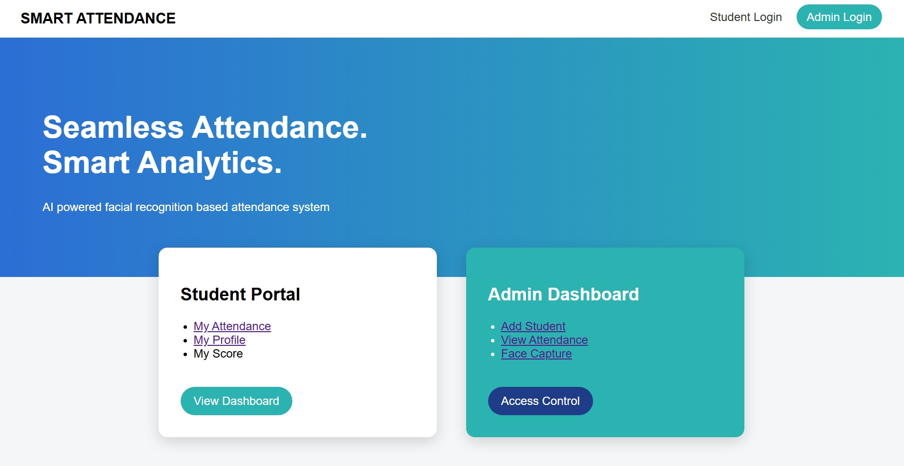
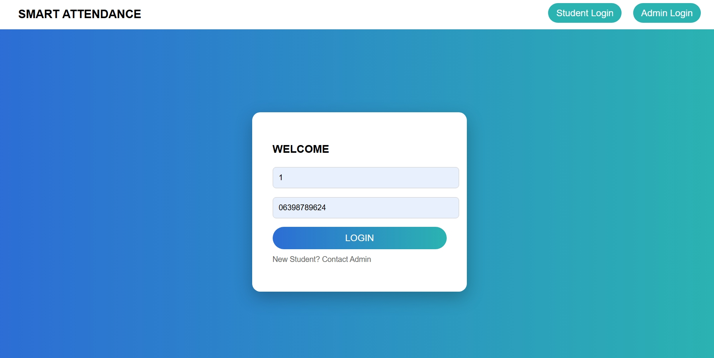
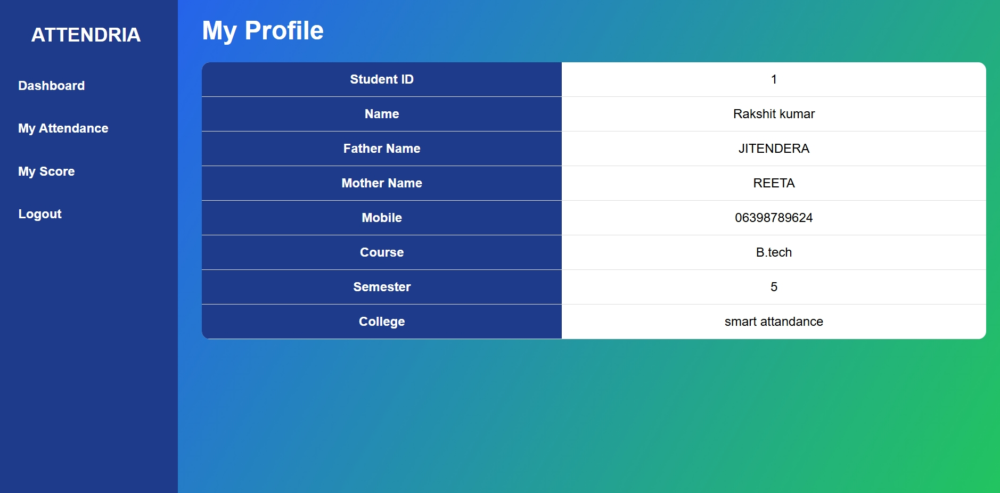
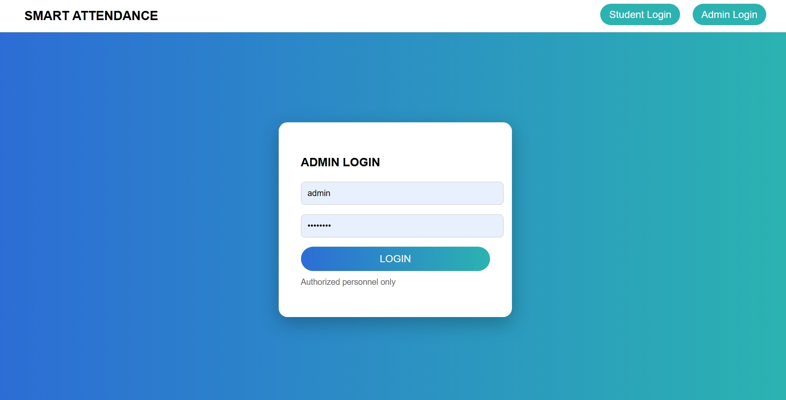
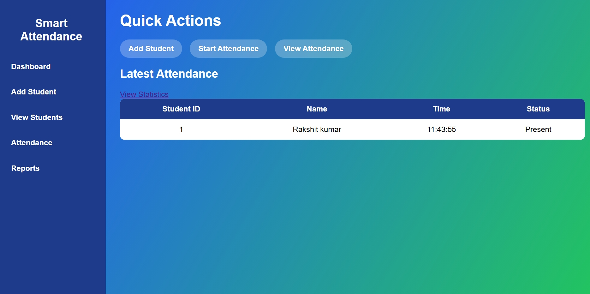
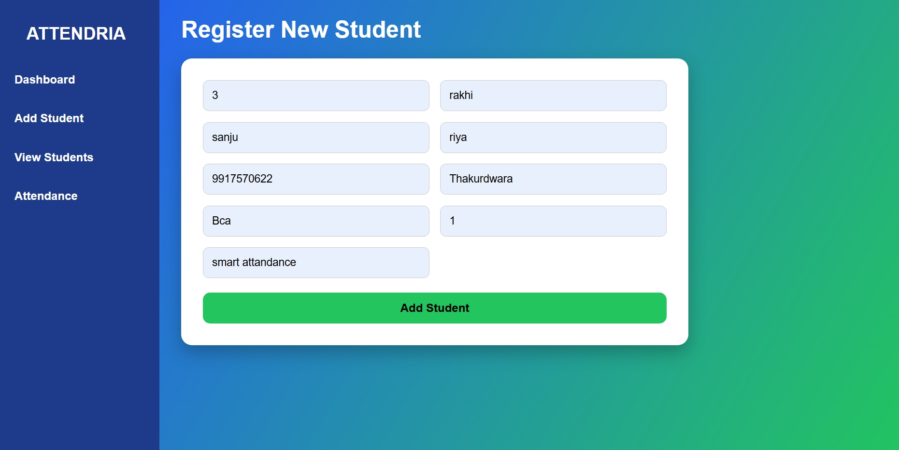
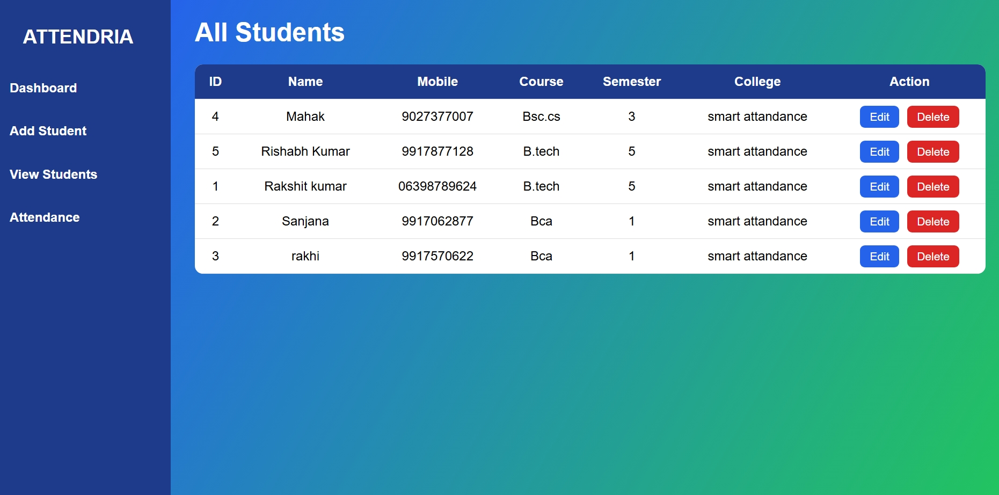
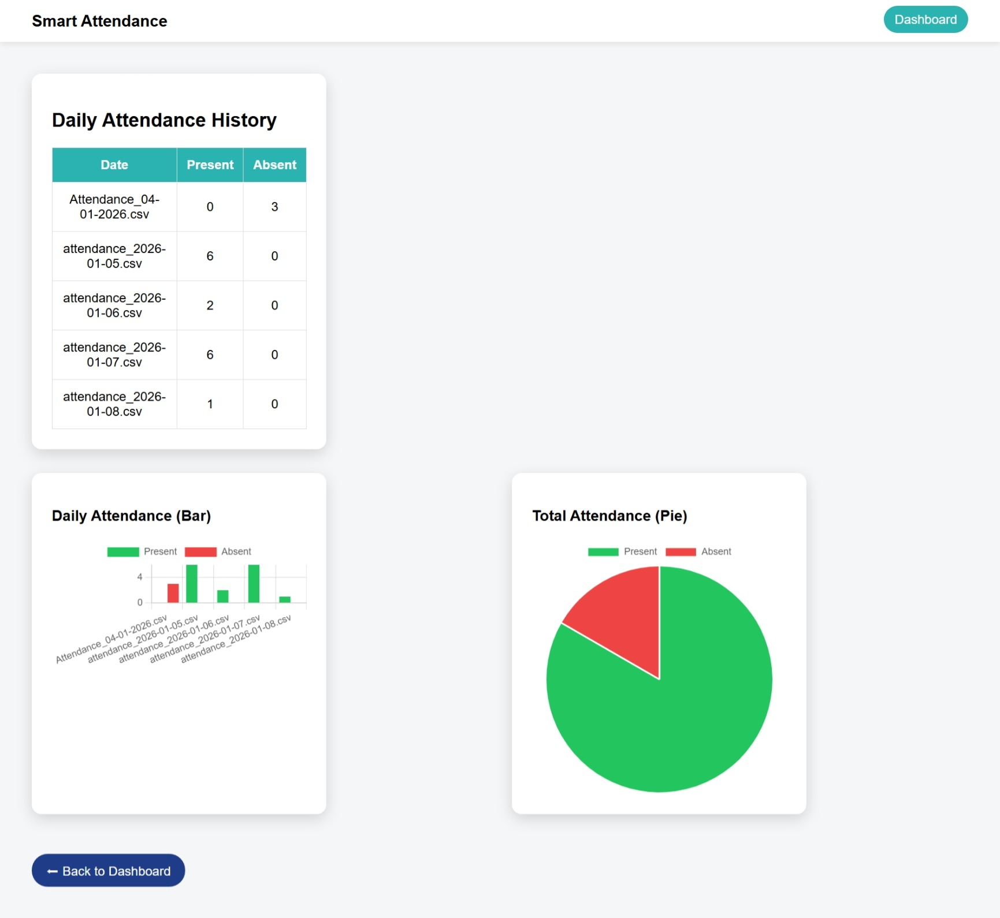

# Smart Attendance System (Face Recognition)

A Python-based Smart Attendance System that automatically marks student attendance using a webcam and face recognition technology.

## Features

* Face detection using OpenCV
* Automatic attendance marking
* Attendance stored in CSV file
* Admin & Student login dashboard
* Attendance history tracking

## Technologies Used

* Python
* OpenCV
* Flask
* HTML, CSS
* Machine Learning

## Working Process

1. Register student face images
2. Train the model
3. Start webcam
4. System recognizes face
5. Attendance automatically recorded

## Installation

Install required libraries:
pip install opencv-python flask numpy pandas

## Run Project

python app.py

## Project Screenshots

### Home Page

### Student Login

### Student Dashboard

### Profile

### Admin Login

### Admin Dashboard

### Add Student

### All Students

### Attendance Files

## Author

Rakshit Kumar
B.Tech CSE (Artificial Intelligence)
